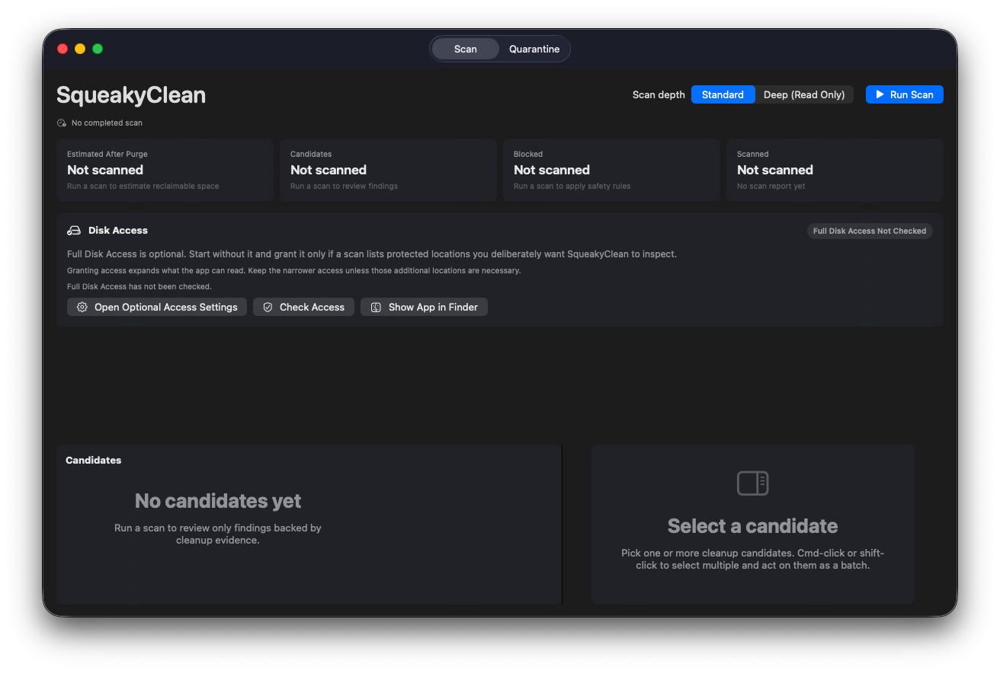
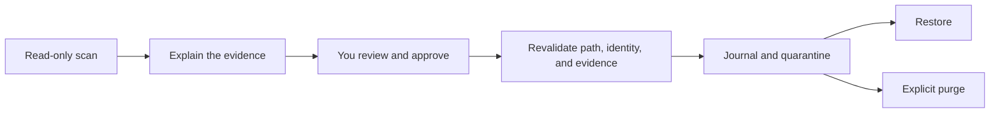

<div align="center">
  <h1>SqueakyClean</h1>
  <p><strong>A macOS cleaner that treats uncertainty as a stop sign.</strong></p>
  <p>Inspect known leftover locations, review the evidence, and quarantine only what you approve.</p>
  <p>
    <a href="https://github.com/YKKULTRA/squeakyclean/actions/workflows/ci.yml"></a>
    
    
  </p>
  <p>
    <a href="#quick-start">Build from source</a> ·
    <a href="#safety-by-design">Safety model</a> ·
    <a href="CHANGELOG.md">Changelog</a>
  </p>
</div>

<p align="center">
  
</p>

SqueakyClean is a native SwiftUI utility for careful macOS cleanup. It scans an allowlisted set of leftover locations, explains why a finding is actionable, and keeps cleanup reversible until you explicitly purge it. Scanning and cleanup happen locally.

> [!NOTE]
> SqueakyClean is an early, deliberately narrow preview. Today it offers cleanup only for user LaunchAgent plists whose configured absolute target is definitively missing. It is not yet a general cache cleaner or app uninstaller.

## Why SqueakyClean

| Evidence first | Reversible by default | Local and transparent |
|---|---|---|
| Uncertain ownership is ignored, never treated as proof that data is abandoned. | Approved items enter an app-managed quarantine and can be restored before purge. | Every candidate includes a reason and evidence. There are no third-party Swift package dependencies. |

Most cleaners optimize for how much they can find. SqueakyClean optimizes for how confidently it can leave the right things alone.

## How it works



1. **Scan:** Standard mode inventories selected user locations. Deep mode adds system-wide locations for analysis only.
2. **Classify:** The rules fail closed. Protected, installed, Apple-managed, inaccessible, unresolved, and unknown data is not offered for cleanup.
3. **Review:** Search, filter, inspect evidence, select one or many candidates, and approve the exact items you want moved.
4. **Revalidate:** Immediately before a move, SqueakyClean checks the canonical path, filesystem identity, modification state, ownership, and missing-target evidence again.
5. **Quarantine:** The move is journaled and fingerprinted. Restore remains available until a separately confirmed purge.

> [!IMPORTANT]
> Quarantine normally does not free disk space because the payload remains on the same disk. Space is reclaimed only after a separate, explicitly confirmed purge. Displayed sizes are allocated-byte estimates.

## Current cleanup scope

| Finding | Current behavior |
|---|---|
| User LaunchAgent with an absolute target confirmed missing | Reviewable cleanup candidate |
| Unmatched app-like data | Ignored as unknown |
| Installed-app or Apple-managed data | Blocked |
| Relative, malformed, unresolved, or inaccessible launch target | Left untouched |
| Any `/Library` finding from Deep mode | Analysis only |
| Cache, log, preference, Application Support, temporary, or receipt data | Inventoried, but not actionable in this release |

This narrow scope is intentional. A catalog miss or an old file is not enough evidence that something is safe to remove.

## Safety by design

- **Read-only until approval.** Scanning never mutates discovered files.
- **Fail-closed decisions.** Unknown or incomplete evidence stops the cleanup path.
- **Approval-time revalidation.** Allowed roots, protected paths, filesystem identity, modification state, installed-app ownership, and launch-target evidence are checked again around the move.
- **Crash-aware transactions.** An atomically written journal and cross-process lock serialize quarantine, restore, and purge operations. Ambiguous interrupted states remain visible instead of being guessed away.
- **Verified restore.** Type-separated SHA-256 fingerprints cover full file contents and deterministic directory entries, including hidden files and package contents. Restore verifies the payload before and after moving it.

The detailed invariants and current trust boundaries are documented in [the safety model](Docs/SAFETY.md).

## Quick start

### Requirements

- macOS 14 or newer
- A Swift 6.3-capable toolchain
- Xcode Command Line Tools for building and code signing

### Build the app

```bash
git clone https://github.com/YKKULTRA/squeakyclean.git
cd squeakyclean
Scripts/build-app.sh
open build/SqueakyClean.app
```

The default local build targets the current Mac architecture and uses an ad hoc signature. To build a universal app for Apple silicon and Intel Macs:

```bash
ARCHS="arm64 x86_64" Scripts/build-app.sh
```

For Developer ID signing, select an installed identity:

```bash
ARCHS="arm64 x86_64" \
CODE_SIGN_IDENTITY="Developer ID Application: Example, Inc. (TEAMID)" \
Scripts/build-app.sh
```

Real signing identities automatically enable the hardened runtime and request a secure timestamp. `BUILD_DIR`, `MACOSX_DEPLOYMENT_TARGET`, and `WARNINGS_AS_ERRORS=1` provide additional build controls.

## Development

```bash
swift build -Xswiftc -warnings-as-errors
swift test -Xswiftc -warnings-as-errors
ARCHS="arm64 x86_64" WARNINGS_AS_ERRORS=1 Scripts/build-app.sh
```

GitHub Actions performs strict release builds and tests, packages a universal app bundle, verifies its architectures and signature, and uploads the archive as a workflow artifact.

### Project layout

| Path | Purpose |
|---|---|
| `Sources/SqueakyCleanCore` | Inventory, classification, path policy, quarantine, restore, and audit logic |
| `Sources/SqueakyCleanApp` | SwiftUI interface and user workflows |
| `Tests/SqueakyCleanCoreTests` | Core correctness and transaction-safety coverage |
| `Resources/Info.plist` | App bundle metadata |
| `Scripts/build-app.sh` | Native or universal app packaging, signing, and verification |

## FAQ

<details>
<summary><strong>Does SqueakyClean delete anything automatically?</strong></summary>

No. Scans are read-only. A candidate moves only after explicit approval, and permanent purge requires a separate destructive confirmation.
</details>

<details>
<summary><strong>Is Full Disk Access required?</strong></summary>

No. Start without it. The app explains when a deliberately selected scan location could not be read, and its access check is a practical probe rather than an operating-system entitlement verdict.
</details>

<details>
<summary><strong>Does it remove caches or Application Support folders?</strong></summary>

Not in the current release. Those locations may be inventoried, but only positively identified dead user LaunchAgents can become cleanup candidates.
</details>

<details>
<summary><strong>Where does SqueakyClean keep its own data?</strong></summary>

Audit history, transaction state, and quarantined payloads live under `~/Library/Application Support/SqueakyClean`.
</details>

## Project status

SqueakyClean is currently version `0.1.0` and under active development. This repository ships source code and development artifacts, not a notarized public release. Public distribution still requires Developer ID signing, Apple notarization, and a finalized permissions story.

A project license has not yet been selected. See the [changelog](CHANGELOG.md) for the latest work and known scope.
